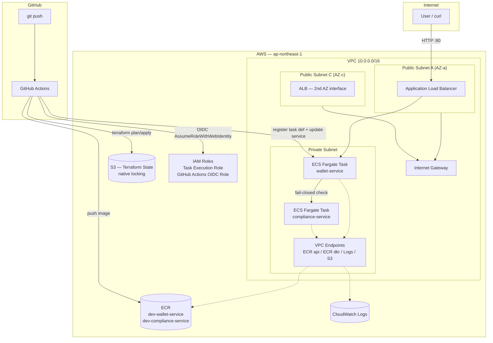

# Architecture

## Overview diagram



## Network design

| Component | Placement | Reasoning |
|---|---|---|
| ALB | Public subnets, 2 AZs | Only internet-facing component. AWS requires ALBs to span 2+ Availability Zones for high availability. |
| ECS Fargate tasks | Private subnet, no public IP | Application code is never directly reachable from the internet — only via the ALB. |
| VPC Endpoints (ECR api/dkr, Logs, S3 gateway) | Private subnet | Lets private-subnet tasks reach AWS APIs without a NAT Gateway — cheaper for narrow, AWS-only outbound needs, and traffic never leaves AWS's network. |
| Internet Gateway | VPC-level, routed from public subnets only | Only the public subnets (ALB) route to the internet; private subnets have no default internet route. |

## Security boundary — Security Groups

The ECS task Security Group's ingress rule references the **ALB's Security Group ID directly**, not a CIDR block:

```hcl
ingress {
  from_port       = 8000
  to_port         = 8000
  protocol        = "tcp"
  security_groups = [aws_security_group.alb.id]   # not cidr_blocks
}
```

This means ECS tasks are unreachable even if their private IP is known — traffic must originate from something carrying the ALB's Security Group, full stop.

## IAM — least privilege, three separate roles

| Role | Used by | Scope |
|---|---|---|
| `dev-ecs-task-execution-role` | ECS itself (not application code) | Pull images from ECR, write logs to CloudWatch |
| `github-actions-crypto-wallet-api` | GitHub Actions CI/CD, via OIDC | ECR push (scoped to `dev-*` repos), ECS update/register (scoped to `dev-cluster`), S3 state bucket read/write, `ReadOnlyAccess` for `terraform plan`, `iam:PassRole` scoped to only the task execution role |
| `sai-admin` (IAM user) | Local developer CLI | AdministratorAccess, programmatic-only, no console access |

## CI/CD pipeline design

Two concerns are deliberately kept in separate, path-scoped GitHub Actions workflows:

1. **Application deploy** (`deploy-wallet-service.yml`, `deploy-compliance-service.yml`) — triggers on push to that service's own path. Build → push SHA-tagged image to ECR → register a new ECS Task Definition revision with the new image → update the live ECS Service.
2. **Infrastructure review** (`terraform-plan.yml`) — triggers on pull requests touching `terraform/**`. Runs `terraform plan` and posts the output as a PR comment for human review. `apply` remains a deliberate, manual step.

**Why the Task Definition is registered dynamically instead of hardcoded in Terraform:** Terraform owns the *shape* of the Task Definition (CPU, memory, networking, IAM role) — infrastructure that changes rarely. The *image tag* changes on every deploy, so CI/CD registers a new revision directly via the AWS CLI rather than requiring a full `terraform apply` for every application release. This avoids conflating infrastructure changes (lower frequency, higher risk) with application deploys (higher frequency, lower risk per change).

**Why OIDC instead of stored AWS access keys:** GitHub Actions requests a short-lived, per-run identity token from GitHub's OIDC provider; AWS verifies it against a trust policy scoped to this specific repository before issuing temporary credentials. No long-lived secret exists anywhere in GitHub.

## Terraform structure

terraform/
├── bootstrap/ # Local state — chicken-and-egg resources that must exist before remote state can be used
│ └── main.tf # S3 state bucket, OIDC provider, GitHub Actions IAM role + policies
├── modules/ # Reusable building blocks, no environment-specific values
│ ├── vpc/
│ ├── security-groups/
│ ├── ecr/
│ ├── iam/
│ ├── ecs/
│ └── alb/
└── environments/
└── dev/ # Composes modules with environment-specific inputs; own remote state

Adding a `staging` or `production` environment means a new folder under `environments/`, calling the same modules — no duplicated resource logic.

## Remote state

- **Backend**: S3, with **native locking** (`use_lockfile = true`, Terraform 1.10+) — no DynamoDB table required, a simplification over the traditional S3+DynamoDB pattern.
- **Bootstrapping**: the state bucket itself is created via a separate, local-state Terraform configuration (`terraform/bootstrap/`), since a resource cannot store its own state inside itself before it exists.